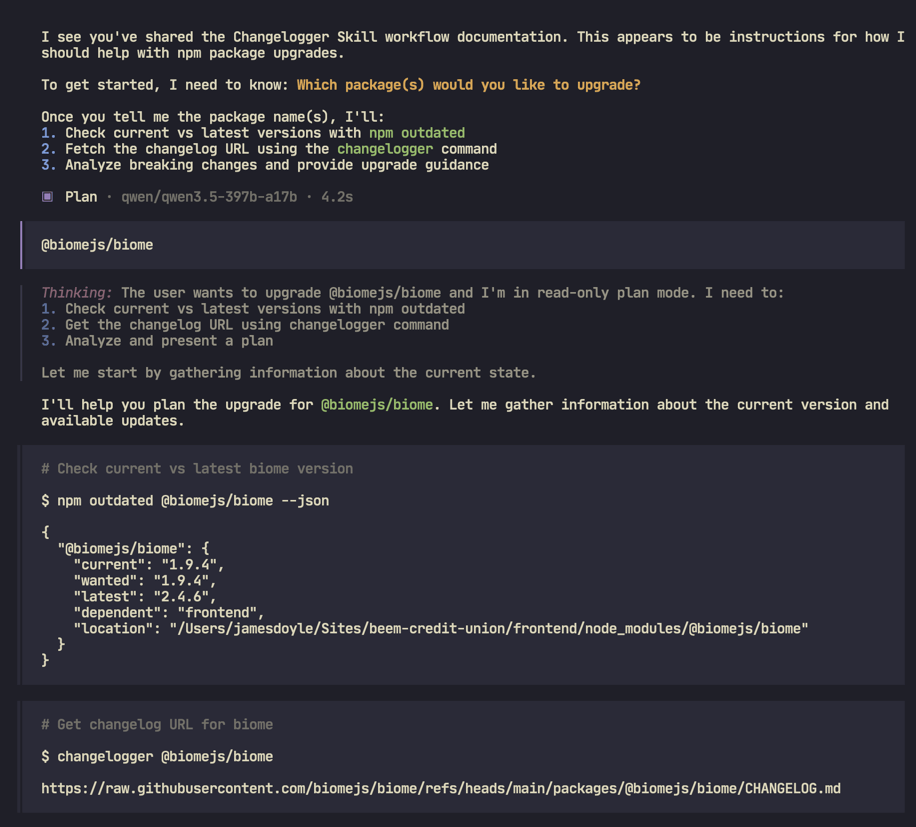
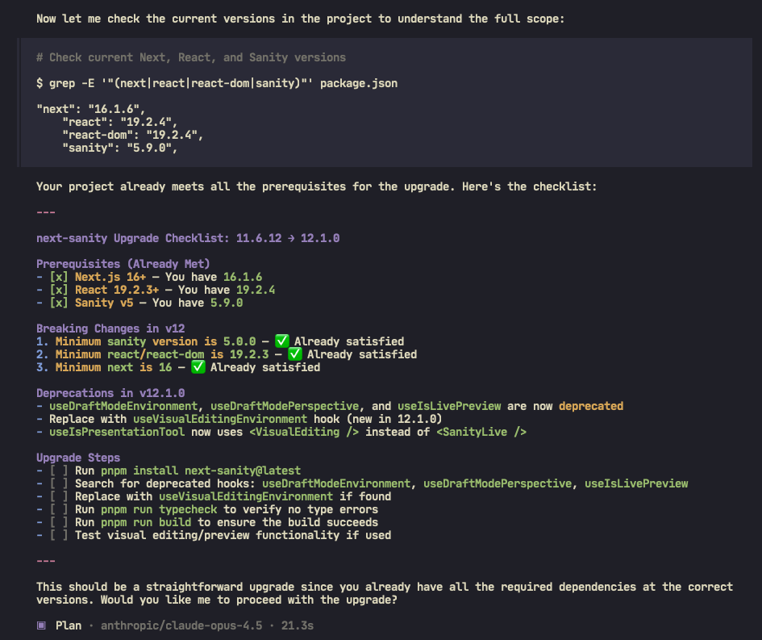

# Changelogger

> Find `CHANGELOG.md` URLs for npm packages. Helpful for agents and tools that need to gather all the changes between outdated packages. See [SKILL.md](SKILL.md) for details





## Installation

```bash
uv tool install git+https://github.com/jamesdoyle/changelogger
# Or from the PIPY:
uv tool install changelogger # not working yet!!
```

Or build and install locally:

```bash
git clone https://github.com/jamesdoyle/changelogger
cd changelogger
uv sync
# then install globally
uv tool install .
```

## Usage

```bash
# if installed as a tool
changelogger <package_name> [package_name2 ...]

# or when cloned, run directly with Python
uv run python changelogger.py <package_name> [package_name2 ...]
```

### Examples

```bash
# when installed globally
changelogger next-sanity-image
# or when cloned, run directly with Python
uv run python changelogger.py next-sanity-image

# Multiple packages
changelogger next-sanity-image sanity-plugin-iframe-pane

# Nested package (handled automatically)
changelogger sanity-plugin-iframe-pane

# With verbose logging
changelogger lodash --verbose
```

### Example Output

```sh
changelogger next-sanity-image sanity-plugin-iframe-pane
# outputs these urls
https://raw.githubusercontent.com/lorenzodejong/next-sanity-image/refs/heads/main/CHANGELOG.md
https://raw.githubusercontent.com/sanity-io/plugins/refs/heads/main/plugins/sanity-plugin-iframe-pane/CHANGELOG.md
```

## How It Works

This tool uses multiple methods to find the `CHANGELOG.md` URL, trying each in order until one succeeds:

1. **unpkg.com** - Check if the package publishes CHANGELOG.md directly to npm
2. **npm view bugs URL** - Extract GitHub repo from package metadata and construct raw URL
3. **npm repo** - Use npm's repo command to get full path (handles nested monorepo packages)

For GitHub URLs, both `main` and `master` branches are tried.

## Development

```bash
# Install dependencies
uv sync

# Run tests
uv run pytest test_changelogger.py -v

# Type checking
uv run basedpyright changelogger.py

# Linting
uv run ruff check changelogger.py
```

## Publishing

To publish a new version of `changelogger` to PyPI:

1. **Build the project**:

This creates the source distribution and wheel in the `dist/` directory.

```bash
uv build
```

2. **Publish to PyPI**:

You will need a PyPI API token.

```bash
uv publish
```

## AI Integration

This repository includes documentation a **SKILL.md** with instructions for AI agents to use `changelogger` when helping users upgrade npm packages.

The `SKILL.md` document provides a complete workflow for package upgrades:

1. Identify outdated packages
2. Fetch changelog URLs with `changelogger`
3. Analyze changelogs for breaking changes
4. Plan and execute migrations

AI agents can use this tool to provide informed upgrade guidance by fetching
and summarizing relevant changelog entries between package versions.

### OpenCode Custom Command

You can create a custom command in [OpenCode](https://opencode.ai/) to easily fetch and summarize changelogs without leaving your terminal.

Create a file named `changelog.md` in your `~/.config/opencode/commands/` (global) or `.opencode/commands/` (project-local) directory:

    ```markdown
    ---
    description: Find and summarize recent updates for an npm package to better help with package upgrades
    subtask: true
    ---

    I need to know the recent changes for given npm package/packages: `$ARGUMENTS`.

    First, use your bash tool to execute the `changelogger` CLI to find CHANGELOG URLs:

    ```bash
    changelogger $ARGUMENTS
    ```

    If the URL is not found, STOP and report the problem.

    Then, unless clarified, get the current details about the installed versions of the target packages:

    ```bash
    npm outdated $ARGUMENTS
    ```

    Now, you can summarize the changes between the currently installed packages and the latest one.
    ```

Once saved, you can run this inside the OpenCode TUI:

```bash
/changelog lodash
```

## License

MIT
